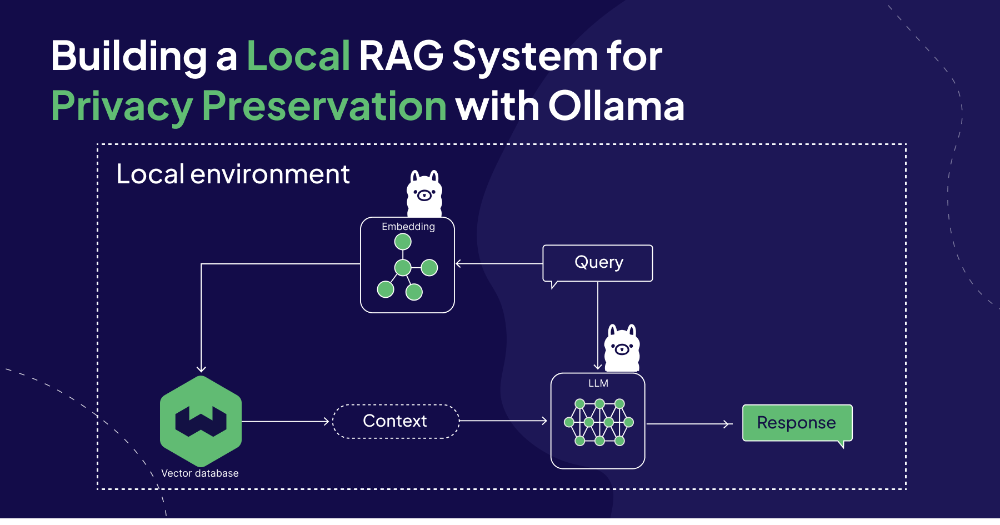

Introduction
============

📄 **Document Query App**

The **Document Query App** is a user-friendly tool designed to explore the contents of text documents through interactive queries. Powered by **Streamlit**, **Chroma**, and **Ollama LLM**, this app leverages advanced language models to retrieve and display relevant information based on your input.

With this app, users can:
- **Upload text documents** and transform their content into retrievable chunks.
- **Interact with the document** by asking questions in natural language.
- **Discover insights instantly**, using cutting-edge vector embeddings and language models.

Key Features
------------

1. **Interactive Document Querying**  
   Upload any plain text document and query its content for specific information.

2. **Model Flexibility**  
   Choose between different language models, such as `llama3` and `mistral`, for tailored results.

3. **Advanced Text Splitting**  
   Utilizes the `RecursiveCharacterTextSplitter` to handle large files and split them into manageable chunks for efficient processing.

4. **Chroma Vector Store Integration**  
   Harness the power of the Chroma library to create a searchable vector representation of your document.

5. **Streamlined Interface**  
   Powered by **Streamlit**, the app provides an intuitive and accessible interface for all users.

How It Works
------------

1. **Upload Your Document**:  
   Upload a plain text file using the drag-and-drop interface or file uploader.

2. **Select a Model**:  
   Choose your preferred language model from the sidebar to customize your experience.

3. **Process Your Document**:  
   The document is split into chunks and stored as vectors using the selected model.

4. **Ask Questions**:  
   Enter your question in the provided text box, and the app will retrieve relevant content from your document.

Ollama
----------

Figure: Ollama 

Use Cases
---------

- **Researchers**: Quickly find specific information in large datasets or research papers.
- **Students**: Search through textbooks or notes to retrieve key concepts and explanations.
- **Businesses**: Extract relevant insights from reports, contracts, or other corporate documents.

Getting Started
---------------

Follow the :doc:`installation` and :doc:`usage` sections to set up and start using the Document Query App.
